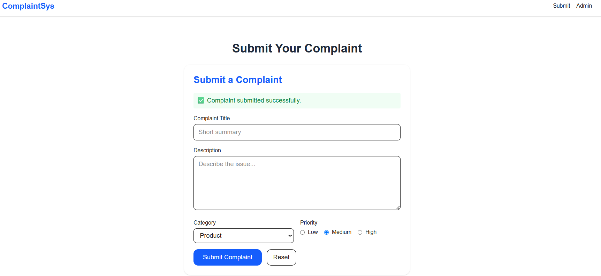
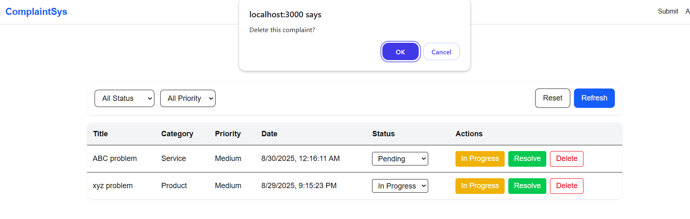
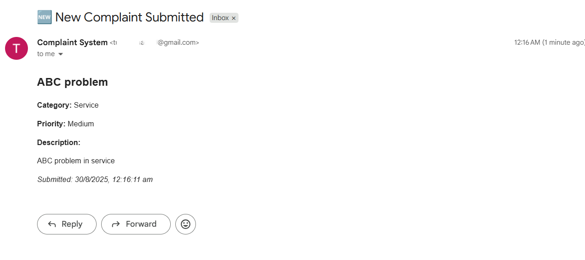

# Complaint Management System

A web application to submit, manage, and track complaints with email notifications and MongoDB storage. Built using **Next.js 13**, **Tailwind CSS**, **Node.js**, and **MongoDB**.

---
📸 Screenshots
### 🏠 Homepage or complaint Page



### 👥 Admin Page



### 👥 Check Email



---
📝 How to Use the Application

Submit a Complaint
Go to the "Submit Complaint" page.
Fill out the complaint form with your details.
Click Submit.

Manage Complaints
Admins can log in to view all complaints.
Update status, priority, or category of complaints.
Changes will trigger email notifications to the users.

Email Notifications
Users receive emails when their complaint is updated.
Emails are sent via your configured SMTP service.

---
📧 Email Functionality

The application uses Nodemailer for sending emails. To configure:
Ensure you have SMTP credentials from your email provider.
Set the environment variables in .env as shown above.
The server automatically sends emails when complaints are submitted or updated.

---
🗄️ MongoDB Setup

Create a free cluster at MongoDB Atlas.
Create a database (e.g., complaintDB).
Create a user with access to the database.
Copy the connection string and update MONGODB_URI in your .env file.
The application will automatically create the necessary collections on first run.

---
🛠️ Tech Stack

Frontend: Next.js 13, Tailwind CSS
Backend: Node.js, Express.js
Database: MongoDB
Email Service: Nodemailer (SMTP)
Deployment: Vercel / Heroku

---
📌 License
This project is licensed under the MIT License.

---
## 🔧 Setup Instructions

1. **Clone the repository**
```bash
git clone https://github.com/your-username/complaint-management-system.git
cd complaint-management-system

2. Install dependencies
npm install


3. Set up environment variables
Create a .env file in the root directory with the following variables:

MONGODB_URI=mongodb+srv://<username>:<password>@cluster0.mongodb.net/complaintDB?retryWrites=true&w=majority
EMAIL_HOST=smtp.example.com
EMAIL_PORT=587
EMAIL_USER=your-email@example.com
EMAIL_PASS=your-email-password
NEXT_PUBLIC_BASE_URL=http://localhost:3000


Replace the values with your MongoDB connection and email credentials.

4. Run the application locally
npm run dev


The application will run at http://localhost:3000.
